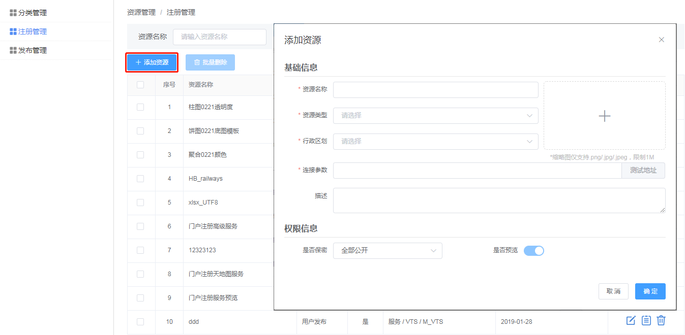
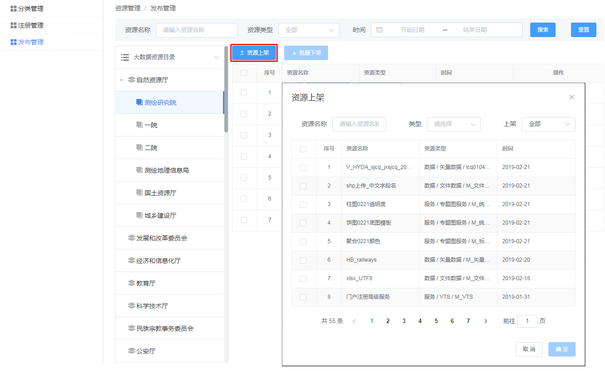
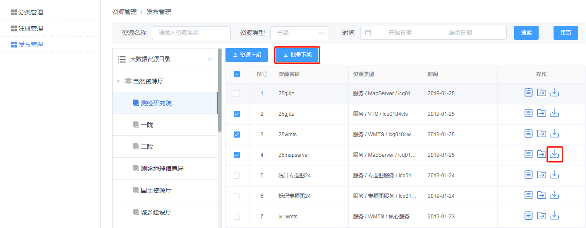

>## 概述

&emsp;&emsp;资源管理提供了在运维端管理平台所有资源的能力。管理员可向资源池中注册新资源，并且可以将资源池中的资源发布到资源中心，供平台用户查看和使用。

>## 资源注册

&emsp;&emsp;管理员进入运维的【资源管理&rarr;注册管理】界面，点击“添加资源”按钮，弹出添加资源窗口，选择资源类型并填写资源信息后，资源池中即添加一条新的资源。

图2-4 资源注册

>## 资源发布

&emsp;&emsp;1. 上架

&emsp;&emsp;管理员进入运维的【资源管理&rarr;发布管理】界面，选择资源挂接的目录树节点，点击“资源上架”按钮，弹出资源上架窗口，展示资源池的所有资源，选中资源即可发布到资源中心。

图2-5 资源上架

&emsp;&emsp;2. 下架

&emsp;&emsp;资源上架后，如果资源不再提供其他用户查看和使用，管理员可以将资源下架。在【资源管理&rarr;发布管理】界面，定位到资源挂接的目录树节点，选择一个资源点击“下架”按钮，或者勾选多个资源，点击“批量下架”按钮，所选的资源被下架

图2-6 资源下架
