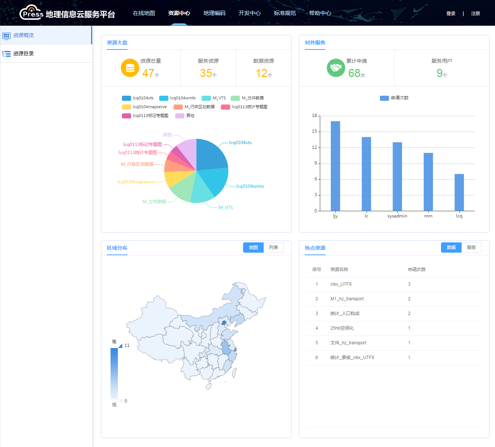
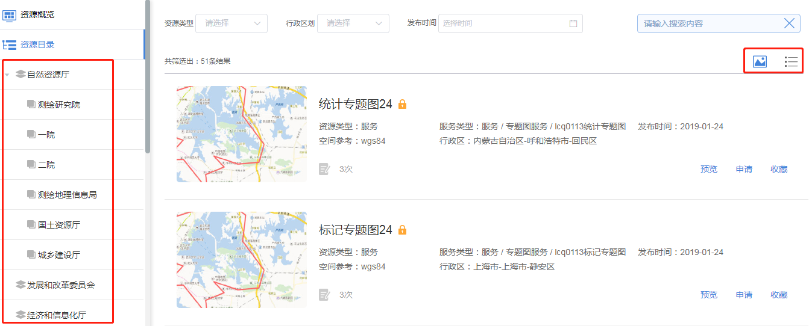
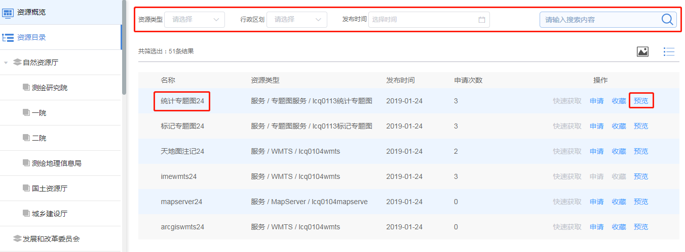

>## 概述

&emsp;&emsp;在【资源中心&rarr;资源概览】界面，展示了平台资源发布和资源使用的统计情况。资源大盘采用饼状图展示已发布的服务和数据的资源分类统计情况；对外服务采用柱状图展示不同用户申请资源的统计情况；区域分布以分布图和列表展示各级行政区划的资源情况；热点资源以排行榜形式展示平台申请热度最高的十大资源。

图2-7 资源概览

&emsp;&emsp;在【资源中心&rarr;资源目录】界面，以目录树视图形式展示平台所有上架资源，点击“大图”或“列表”可以切换资源的展示方式。

图2-8 资源目录

&emsp;&emsp;平台支持资源类型、行政区划、发布时间、关键词的条件检索资源。点击资源名称，可以查看资源详情信息。点击“预览”按钮，可以在地图窗口查看资源。

	

图2-9 资源检索和查看
